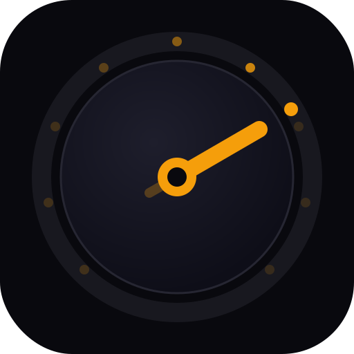

<p align="center">
  <a href="https://github.com/oleg-koval/mac-dev-station/actions/workflows/ci.yml"></a>
  <a href="https://goreportcard.com/report/github.com/oleg-koval/mac-dev-station"></a>
  <a href="https://pkg.go.dev/github.com/oleg-koval/mac-dev-station"></a>
  <a href="https://securityscorecards.dev/viewer/?uri=github.com/oleg-koval/mac-dev-station"></a>
</p>

<p align="center">
  
</p>

<h1 align="center">mac-dev-station</h1>

<p align="center">
  One-command dev environment setup for macOS · Apple Silicon · macOS 14+<br>
  <strong>Fresh Mac → full productivity stack in minutes</strong>
</p>

---

## Features

- **13 idempotent phases** — safe to re-run; each phase skips already-done work
- **Auto backups** — existing configs moved to `~/.dotfiles-backup-YYYYMMDD/` before overwriting
- **Confirms before overwriting** — prompts if a config already exists
- **No magic** — prints every command before running
- **Homebrew-installable** — or curl-install without Homebrew
- **Apple Silicon + Intel** — darwin arm64 and amd64 binaries

## Install

### Homebrew (recommended)

```bash
brew tap oleg-koval/tap
brew install mac-dev-station
mac-dev-station
```

### Without Homebrew

```bash
curl -fsSL https://raw.githubusercontent.com/oleg-koval/mac-dev-station/main/install.sh | bash
```

### From source

```bash
go install github.com/oleg-koval/mac-dev-station/cmd/mac-dev-station@latest
```

## Usage

```bash
mac-dev-station
```

Runs all 13 phases interactively. Each phase prints its status and pauses for manual steps where system permissions are required.

## What it does

| # | Phase | Outcome |
|---|-------|---------|
| 0 | Pre-flight | macOS version, brew, xcode-select, gh auth check |
| 1 | Foundations | Install/update Homebrew, xcode-select |
| 2 | Brewfile | Install all CLI tools and GUI apps |
| 3 | Folders | Create `~/Work` (PARA), `~/oss`, `~/code` |
| 4 | Karabiner | Hyper key config + app launchers |
| 5 | AeroSpace | Tiling WM with auto-routing to workspaces |
| 6 | Hammerspoon | Display dock/undock auto-detection |
| 7 | kitty | Terminal config + project switcher (Cmd+P) |
| 8 | Shell | zsh + starship + aliases + 9am backup cron |
| 9 | Raycast | Open for first-time setup (Cmd+Space) |
| 10 | OSS starters | Clone `oleg-koval/starters` |
| 11 | Permissions | Walks you through Accessibility, Driver Extensions |
| 12 | Verification | Final smoke test of every component |
| 13 | Cheatsheet | Prints all hotkeys |

## What gets installed

**CLI tools** (via Homebrew):
`git` `gh` `fnm` `uv` `starship` `zoxide` `atuin` `fzf` `ripgrep` `fd` `bat` `eza` `glow` `btop` `jq` `yq` `delta` `tmux` `neovim` `displayplacer`

**GUI apps** (via cask):
`kitty` `cursor` `raycast` `karabiner-elements` `hammerspoon` `aerospace` `orbstack` `1password-cli`

**Fonts:** Geist Mono, JetBrains Mono Nerd Font

## Hotkey map

### Hyper Key (Caps Lock → Hyper via Karabiner)

| Key | Action |
|-----|--------|
| `Caps tap` | Escape |
| `Caps+T` | Workspace 3 → kitty |
| `Caps+B` | Workspace 1 → Chrome |
| `Caps+C` | Workspace 2 → Cursor |
| `Caps+S` | Workspace 4 → Slack |
| `Caps+L` | Workspace 4 → Linear |
| `Caps+F` | Workspace 5 → Figma |
| `Caps+N` | Workspace 6 → Notion |
| `Caps+H/J/K/;` | Arrow keys |

### AeroSpace (Alt prefix)

| Key | Action |
|-----|--------|
| `Alt+1-9` | Switch workspace |
| `Alt+Shift+1-9` | Move window to workspace |
| `Alt+H/J/K/L` | Focus window (vim) |
| `Alt+Shift+H/J/K/L` | Move window |
| `Alt+F` | Fullscreen |
| `Alt+/` | Tiling layout |
| `Alt+,` | Accordion layout |

### Hammerspoon

| Key | Action |
|-----|--------|
| `Cmd+Ctrl+Alt+D` | Force apply display layout |
| (auto) | Detects monitor connect/disconnect with 9s debounce |

### kitty

| Key | Action |
|-----|--------|
| `Cmd+P` | Project switcher (fzf) |
| `Cmd+T` | New tab |
| `Cmd+D` | Vertical split |
| `Cmd+Shift+D` | Horizontal split |

## Shell aliases

```bash
dev <name>      # Full env: Cursor + kitty + GitHub in correct workspaces
work <name>     # kitty only, workspace 3
proj            # fzf project picker → cd
go              # fzf picker → full dev env
newproj <name>  # Scaffold new (project|area|scratch|oss)
sync_projects   # Refresh kitty picker
dock / undock   # Manual display layout trigger
dclean          # Docker compose nuke + rebuild
```

## Manual steps after install

The script pauses and guides you through:

1. **Driver Extensions** for Karabiner (reboot required after first grant)
2. **Accessibility** for AeroSpace, Hammerspoon, Raycast
3. **Cmd+Space rebind** from Spotlight to Raycast
4. **Run `displayplacer list`** while docked, paste output into `~/oss/scripts/layout-docked.sh`
5. **Fill `~/.zsh/secrets.zsh`** with your API keys
6. **Sign in** to: `gh`, 1Password CLI, Cursor, Raycast (optional), Atuin (optional)

## Uninstall

```bash
brew uninstall mac-dev-station
brew untap oleg-koval/tap
```

Removes only the bootstrap CLI — your installed apps and configs stay intact.

## System Requirements

- macOS 14+ (Sonoma or later)
- Apple Silicon (arm64) or Intel (amd64)
- Xcode Command Line Tools (`xcode-select --install`)

## Architecture

```
cmd/mac-dev-station/    # CLI entry point (cobra)
internal/
  phases/               # One file per setup phase (0–13)
  configs/              # Embedded config templates
  reporter/             # Phase progress output
  system/               # macOS checks and helpers
```

## Development

```bash
make test     # run tests with race detector
make lint     # golangci-lint
make cover    # coverage report → coverage.html
make build    # build binary to bin/mac-dev-station
make fmt      # gofmt + go fmt
make tidy     # go mod tidy
```

## Roadmap

- [ ] `--skip-<phase>` flags for selective installs
- [ ] `mac-dev-station update` — pull latest configs and re-apply
- [ ] Dotfiles drift detection — diff installed config vs repo version

## Security Notes

This tool runs shell commands on your local machine. See [SECURITY.md](./SECURITY.md) for the vulnerability disclosure policy and supply-chain notes.

## Contributing

PRs welcome. See [CONTRIBUTING.md](./CONTRIBUTING.md) and [AGENTS.md](./AGENTS.md).

## License

MIT — see [LICENSE](./LICENSE)

## Author

[Oleg Koval](https://github.com/oleg-koval)

---

<p align="center">
  <a href="https://github.com/oleg-koval/mac-dev-station">GitHub</a> ·
  <a href="https://github.com/oleg-koval/mac-dev-station/releases">Releases</a> ·
  <a href="https://github.com/oleg-koval/mac-dev-station/issues">Issues</a> ·
  <a href="https://buymeacoffee.com/olko">☕ Buy me a coffee</a>
</p>
